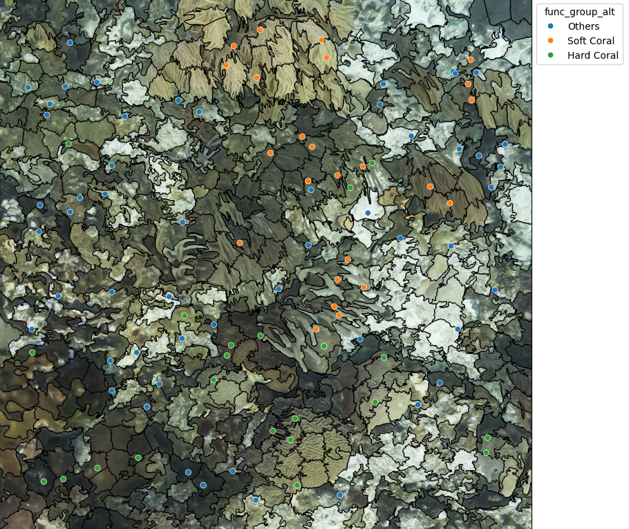

# SAM and PLASPIX development

## Description
During this project, we conducted experiments and research on various approaches for creating dense segmentation masks for corals using images of coral reefs and sparse point labels. The project focused on implementing the SAM (Segment Anything Model) and PLASPIX approaches in combination with different label propagation techniques and superpixel models to improve segmentation accuracy and efficiency. 

## Inspiration and Data
The initial inspiration was from one of the startups [Fruitpuch AI Team and one of their challenges](https://app.fruitpunch.ai/challenge/ai-for-coral-reefs-2#overview). All the data that were used can be found [here](http://data.qld.edu.au/public/Q1281/) and in our case we used photo quadrants.

## Table of Contents
- [Description](#description)
- [Inspiration and Data](#inspiration-and-data)
- [Badges](#badges)
- [Visuals](#visuals)
  - [Original Data and Super Pixels](#original-data-and-super-pixels-slic-example)
  - [Propagated Labels (Diffusion)](#propagated-labels-diffusion)
  - [Coral Segmentation Examples with SAM](#coral-segmentation-examples-with-sam)
  - [Coral Segmentation Examples with PLASPIX](#coral-segmentation-examples-with-plaspix-slic--diffusion)
- [Installation](#installation) - careful with python version if you run locally 
  - [Requirements](#requirements)
  - [Steps](#steps)
- [Usage](#usage) - Note on Google Colab Run!!!
- [Contributing](#contributing)
- [Authors and Acknowledgment](#authors-and-acknowledgment)
- [License](#license)
- [Project Status](#project-status)


## Badges


## Visuals
To better understand the results and the models used in this project, here are some visual aids:

#### Original data and Super Pixels (SLIC Example)
 
#### Propagated Labels (Diffusion)


#### Coral Segmentation Examples with SAM:


#### Coral Segmentation Examples with PLASPIX (SLIC + Diffusion):
- 


## Installation
To set up and run this project locally, follow these steps:

#### Requirements
- `Python - 3.10.14` !
All the requirements can be found under `requirements.txt` file. If you would like to run the notebook locally, make sure to adjust the file paths in the `pipeline.ipynb` and remove the `google` imports in the Imports section. 

#### Steps:
1. Clone the repository:
    ```bash
    git clone https://github.com/yourusername/yourproject.git
    ```
2. Navigate to the project directory:
    ```bash
    cd yourproject
    ```
3. Create and activate a virtual environment (optional but recommended):
    ```bash
    python3 -m venv venv
    source venv/bin/activate
    ```
4. Installable required dependencies:
    ```bash
    pip install -r requirements.txt
    ```
5. **If you find problems with *pydencrf* library**:    
    If the problem originates from the wheel, look up the wheel online and download it manually 
    If the problem originates somewhere else, check the python version


## Usage
After the installation, you can run the main pipeline through your google colab session. The file that you have to run is `pipeline.ipynb`. Make sure to check that you have created a short cut for images that are on google drive or/and change the global paths. 
**NOTE**: If you run the pipeline in google colab, make sure to add the following folders to working environment: `packages`, `processings`, `assets`.

## Contributing
We welcome contributions! To contribute:

1. Fork the repository.
2. Create a feature branch (`git checkout -b feature/new-feature`).
3. Commit your changes (`git commit -m 'Add a new feature'`). 
4. Push to the branch (`git push origin feature/new-feature`).
5. Open a Pull Request.

Make sure to check our contributing guidelines for more details.

## Authors and acknowledgment
This project was created by `Aleksandr Raudvee`, `Ansant Omurzakov`, `Leo Yang`, `Cris Bitca`, `Timofey Iukhnov`, `Igor Freik`. Special thanks to all the contributors and the open-source community for providing valuable tools and libraries that made this project possible.

## License
This project is licensed under the MIT License - see the [LICENSE](LICENSE) file for details.

## Project status
Currently, the project is under active development. Future plans include adding new features and improving model performance. If you'd like to contribute or take over certain aspects, feel free to contact us!
